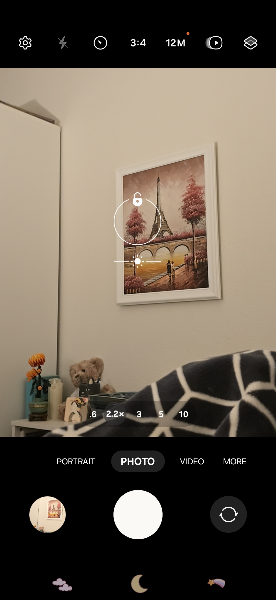
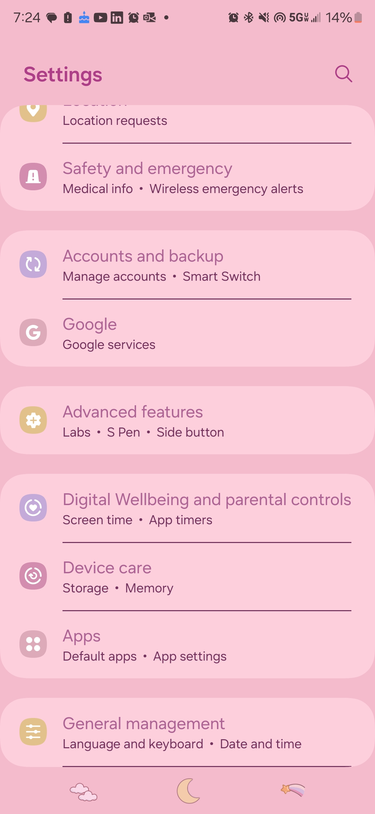
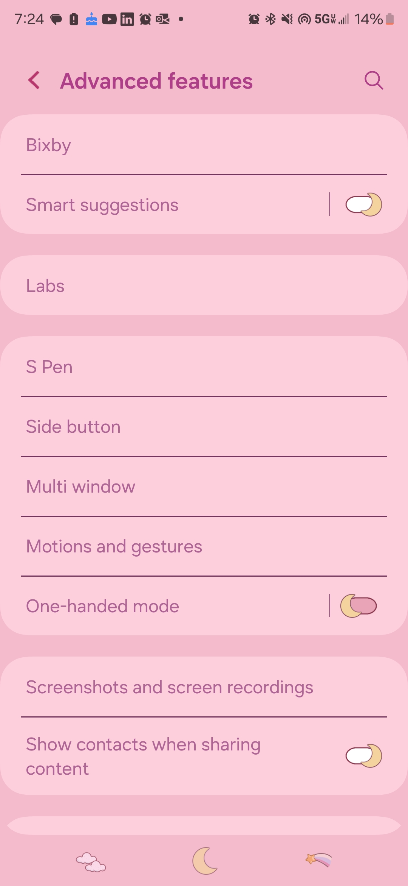
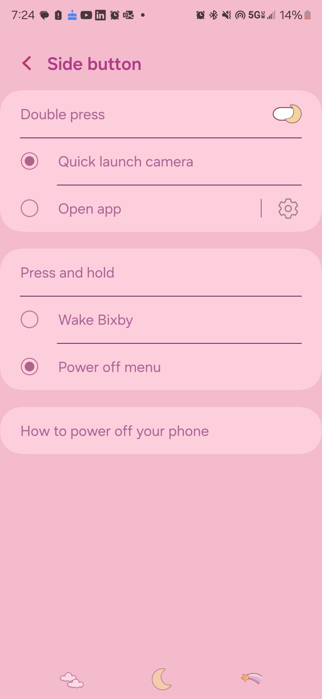

# [Journal Entry 1: S24 Ultra](README.md)

# **Samsung Galaxy S24 Ultra**
**Valarie Mello**

**November 22nd 2024**

This past summer I was faced with the ever inconvenient challenge of having to get a new Phone. Right in the middle of my Summer Internship and before leaving for a short trip my Phone of 2 years faced its tragic end after becoming lodged within the mechanics of my aunt's reclining couch... leaving the once sleek and pristine screen beyond shattered and internal hardware exposed. Thankfully my Manager and mentor were understanding and upon my return, I decided to replace my phone with the newest model the Samsung Galaxy S24 Ultra. My previous phone was the S22 Ultra and while it was an excellent phone I had always felt a hole in my heart for the Note 9 which was and still is my favorite phone to this date.

A Phone is something that we use every day, some days more than others, but regardless it is something that you put a lot of miles on. It is for this reason that it makes an excellent object to study for something like examining its usability. Within this blog post, I want to discuss some of the challenges I face as a user of my new device while providing a little UX knowledge in there to make this a more well-rounded and educational read rather than just, "Val rants about the features on her expensive phone".

*add image of SS24 Ultra for visual 

When I purchased the phone the key things for me were: I wanted to be able to take beautiful photos, and have easy access and use of Google services since most of what I do online is tied to the Google Suite. This naturally put me in a place where I needed to use a Samsung or some sort of Android phone. Now that we have an idea of the goals I set out to accomplish with a given device let us get into some of the interactions I have with this phone based on the goals.

**Taking Beautiful Photos:**

there is no denying that the S24 Ultra has an amazing camera system. The camera is a relatively easy experience typical to any other you might use even on an iPhone. There's a large white circle that acts as the button so with a single tap your photo is captured. This usage lines up with the **mental model** that many users would have for their own experiences and expectations. However, there are a few usability issues that I encountered while using the camera that I have not adjusted to using even after months with the device. 

First, there is an odd way to go about focusing the camera. For starts, you cannot simply drag the focus you instead have to tap to adjust the focus. This is good for the initial focus, but then you are stuck tapping around our screen to try and get the right spot rather than dragging it to the position you want, missing out on seeing the real-time changes of the adjustment. 

This is combined with the second issue of the camera having issues with taking photos up close of objects. I noticed this  when trying to capture a picture of my microscope for an assignment where I had to draw the image as seen in the magnifying device. My phone simply could not get a clear shot of the whole image whereas my peers with older phones had no issue with this. When I eventually captured a crooked photo I had taken way longer than my groupmates making the experience **Unsatisfying, Inefficient, and Ineffective** at accomplishing the task of taking a simple photo. This is also seen when taking up-close photos of writing or my art where it focuses only on one part of the page unfocusing the rest of the image even when adjusting the settings.

As a bonus there is also the strange time when some images randomly become enhanced by AI so as a bonus please have this glam shot of my Cat Mr Dritz. This doesn't have a major impact one way or another on my experience as a user it is just weird and catches me off guard. 

**Google Suit vs Samsung**

The second thing I want to discuss is the minor issues I face with the conflict between Google and Samsung within the device. From the moment you take your Samsung phone out of the box, it is equipped with all of Samsung's features but also the entire Google Suit linked to your Google account. This would normally be very handy but in recent years has seemed to only cause conflict within the device. For instance when saving passwords before the device would simply access your Google Keyring and paste the password, now however you have to use Samsung Pass... but that doesn't work... I've signed in and hit save, and a week later... it's not there? I suppose it is more secure since I have to remember everything myself.

Another thing relating to this conflict is the built-in Bixby button which is also... the power button. To turn on the phone you press the button located on the side below the volume bar. However, when you want to sleep/turn off your phone you press- oh wait no you don't because that tries to have you use Bixby. 

This can be adjusted by...
# * going into Settings (which you have to either pull up another menu or put it on your home screen to access)

# * scrolling till you find Advanced Features

# * Selecting Side Button

# * And finally tap "Power off menu"

Objectively 4 steps isn't a whole lot, but having to dig through 4 pages of your settings just so half-baked Google Assistant doesn't harass you every time you sleep your phone isn't enjoyable. A similar issue is with the AI assistant built right into the keyboard. I find myself constantly tapping the button when trying to highlight a part of a message or pull up an emoji causing me to then have to backtrack through a screen or two to dismiss the thing making it so you can **recover from error** easily but you not feel secure since it still looms. It's those couple of seconds here and there that bother me and make my experience frustrating. 

Overall my experience with the S24 Ultra is not a bad one even with the critiques I have. I will be stuck with the device for the foreseeable future and I like the options it provides me. I feel as though it might have just tried to cram too many features in that it has crowded the device too much. If I were to redesign some fo the features I would go back a few generations and take beats from their older phones but give them the processing power of today.

